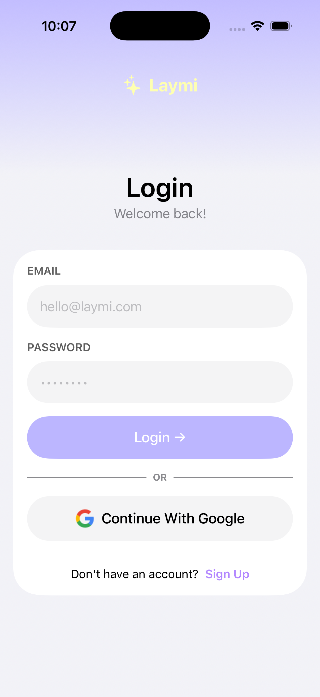
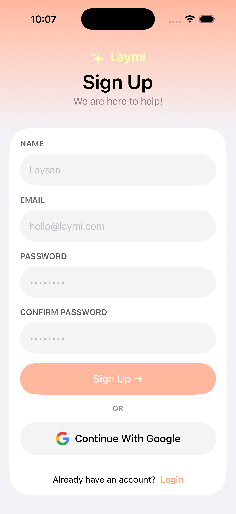
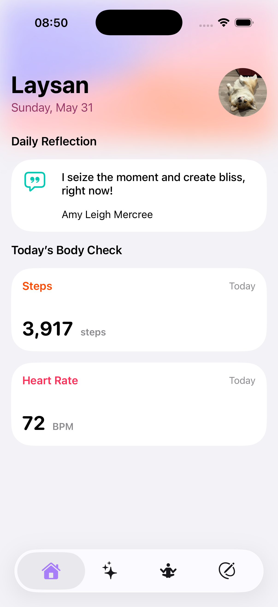
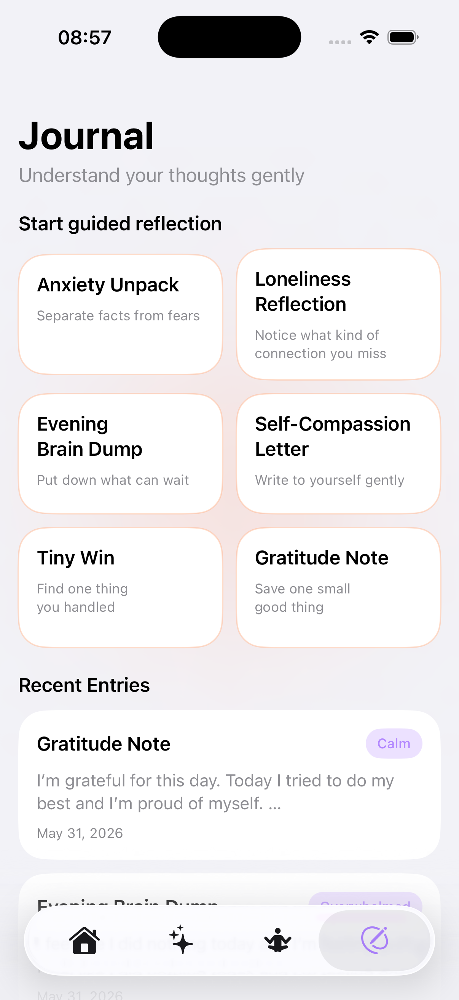
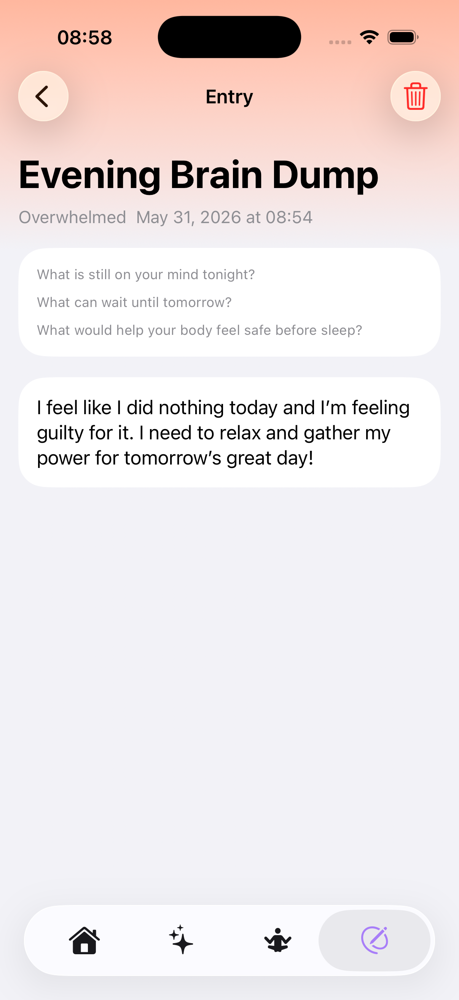
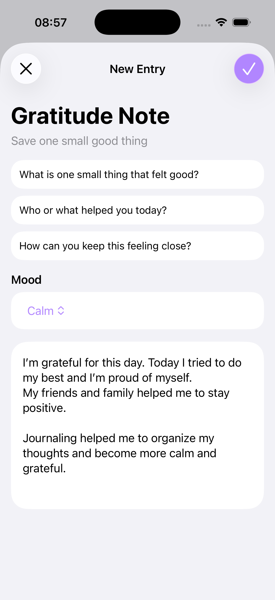
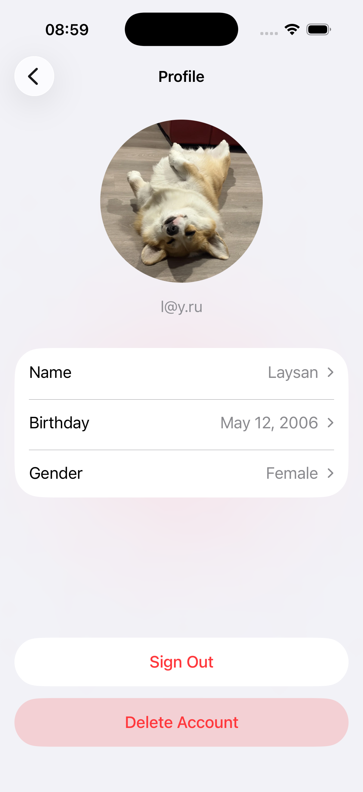
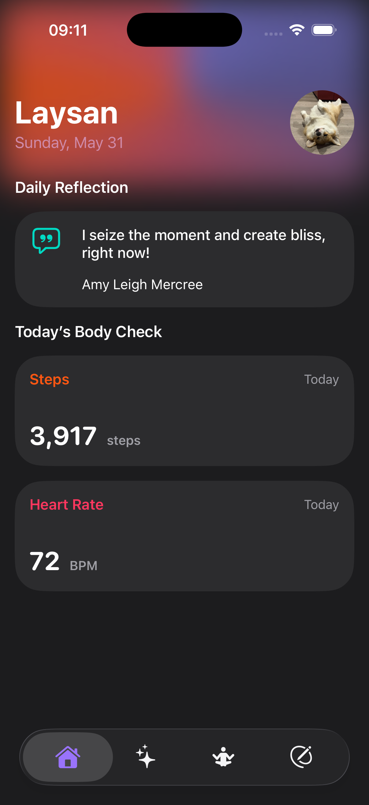
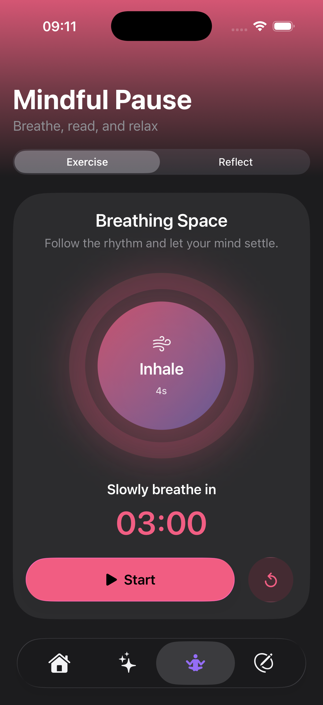
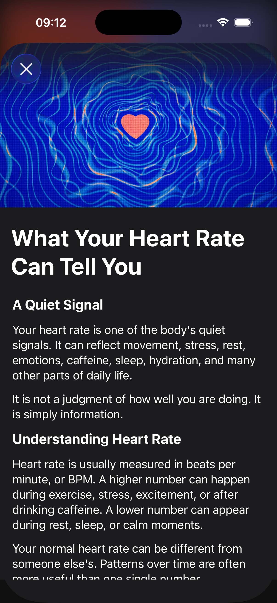

<h1>
  
  Laymi
</h1>

Laymi is an iOS mental wellness companion designed to make everyday self-care feel calm, approachable, and personal. It brings together mindful breathing, reflective journaling, gentle health insights, curated quotes, and a supportive AI-powered chat in one focused experience.

## Features

### Authentication

Users can sign in securely with Firebase Authentication and Google Sign-In before entering the main app flow.

<p align="center">
   &nbsp;
   &nbsp;
</p>

### A Personal Home Screen

The home screen brings together a daily reflection and simple wellbeing signals. With HealthKit permission, users can view their step count and most recent heart rate, then open short educational articles that connect physical signals with mental wellbeing.

<p align="center">
  
</p>

### Supportive AI Chat

Laymi includes a streaming AI chat powered by Gemini through Firebase AI. Responses appear progressively, so the conversation feels immediate rather than static. The assistant is guided by a wellbeing-focused system prompt with clear safety boundaries for crisis situations, self-harm, harm to others, and prompt injection attempts.

<p align="center">
  
  
  

  
</p>
<div align="center">
  <video
    src="https://github.com/user-attachments/assets/05a14312-838a-4466-b825-519f21bb022e"
    width="260"
    controls>
  </video>
</div>


### Mindful Breathing

The breathing exercise offers a three-minute guided practice with visual rhythm, phase instructions, a timer, pause and reset controls, and a completion state.

<p align="center">
  
</p>

### Reflective Quotes

Users can browse a paged collection of supportive quotes. Quotes are cached locally with SwiftData to reduce unnecessary network requests and provide a smoother experience.

<p align="center">
  
</p>

### Guided Journal

The journal provides thoughtful prompts for anxiety, loneliness, gratitude, self-compassion, and small wins. Users can create, review, and delete entries while keeping their reflections stored locally on the device.

<p align="center">
   &nbsp;
   &nbsp;
  
</p>

### User Profile

Users can sign in, maintain a personal profile, and update details such as name, birthday, gender, and profile image.

<p align="center">
  
</p>

### Dark Mode

Laymi supports Dark Mode across the app, preserving its calm visual style and keeping each screen comfortable to use in low-light environments.

<p align="center">
   &nbsp;
   &nbsp;
   
</p>

## Architecture

Laymi follows an MVVM-oriented, feature-based structure:

```text
Laymi/
├── App/                    # App entry point, dependency composition, root flow
├── Core/                   # Shared UI components, extensions, configuration
└── Feature/
    ├── Auth/
    ├── Chat/
    ├── Home/
    ├── Journal/
    ├── Meditation/
    └── Profile/
```

Each feature is separated into focused layers where appropriate:

```text
Model -> Service / Storage -> ViewModel -> View
```

Key architectural decisions:

- Views receive their dependencies through ViewModels.
- Storage implementations are hidden behind protocols and can be replaced with mocks.
- SwiftData repositories handle local persistence and quote caching.
- The chat layer is defined by a streaming `ChatService` protocol.
- UIKit and SwiftUI interoperability is demonstrated in both directions:
  - Health cards are implemented in UIKit and embedded in SwiftUI with `UIViewRepresentable`.
  - Article details are presented through a UIKit `UIViewController`, which hosts a SwiftUI article view using `UIHostingController`.

## 🛠️ Technologies

- Swift
- SwiftUI
- UIKit
- MVVM
- Swift Concurrency: `async/await`, `AsyncThrowingStream`, `async let`
- SwiftData
- HealthKit
- Firebase Authentication
- Google Sign-In
- Firebase AI SDK with Gemini
- Lottie animations
- Swift Testing
- Swift Package Manager

## 🫟 Getting Started

### Requirements

- Xcode
- An iOS Simulator or physical iOS device
- A Firebase iOS configuration file
- An API Ninjas key for quote requests

### 1. Clone The Repository

```bash
git clone https://github.com/Lyasan-byte/Laymi.git
cd Laymi
```

### 2. Add Firebase Configuration

Create a Firebase iOS app and add your local `GoogleService-Info.plist` file to the `Laymi/` directory if it is not already present in your local project setup.

Enable the Firebase products used by the app:

- Firebase Authentication
- Google Sign-In
- Firebase AI Logic

### 3. Add Quote API URLs

Copy the included template:

```bash
cp Secrets.example.xcconfig Secrets.xcconfig
```

Open `Secrets.xcconfig` and replace `YOUR_API_KEY` with your API Ninjas key:

```text
API_NINJAS_QUOTE_OF_THE_DAY_URL = https:/$()/api.api-ninjas.com/v2/quoteoftheday?X-Api-Key=YOUR_API_KEY
API_NINJAS_QUOTES_URL = https:/$()/api.api-ninjas.com/v2/quotes?limit=50&X-Api-Key=YOUR_API_KEY
```

`Secrets.xcconfig` is intentionally ignored by Git.

### 4. Run The App

Open:

```text
Laymi.xcodeproj
```

Select an iOS simulator or physical device and run the `Laymi` scheme.

## Running Tests

The project includes unit tests for ViewModels, mock services, and SwiftData storage.

Covered scenarios include:

- successful data loading
- error handling
- empty states
- filtering
- sorting
- adding data
- deleting data
- saving data
- restoring data from storage
- streaming chat responses

Run the tests in Xcode:

```text
Product -> Test
```

Or use the command line:

```bash
xcodebuild test \
  -project Laymi.xcodeproj \
  -scheme Laymi \
  -destination 'platform=iOS Simulator,name=iPhone 17'
```

## LLM Tools Used

The project uses LLM tools in two ways:

### In-App AI

- **Gemini via Firebase AI Logic** powers the supportive streaming chat.
- A wellbeing-focused system prompt defines the assistant's role, response style, safety boundaries, and handling of prompt injection attempts.

### Development Assistance

- **OpenAI ChatGPT** was used as a development assistant for implementation support, debugging, test scaffolding, and documentation refinement.
